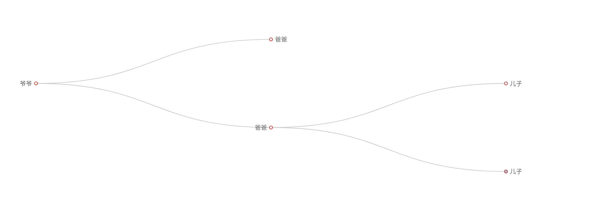

## My HOME PAGE
打算做一个综合性的个人主页.  
访问(http://lihao7086.com)
## Task List
- [ ] 个人展示
    - [x] 个人技能展示[思维导图] (http://lihao7086.com/aboutme/skill/)
    - [ ] 个人项目展示[思维导图]
- [ ] 公共服务
- [ ] 导航栏
- [ ] 秀恩爱
## Qucik Start
* git clone ... & cd  ..
* `python3 manage.py migrate`
* `cd ./aboutme/static` 'vim aboutme.txt`, 完成树状图的内容, 注意缩进必须是5个空格,如下:
```
爷爷
    爸爸
    爸爸
        儿子
        儿子
            孙子
```
* 保存后执行 `python3 txt2json.py aboutme.txt aboutme.json`
* 回到项目跟目录,执行`python3 manage.py runserver 0.0.0.0:8000`并且打开浏览器

